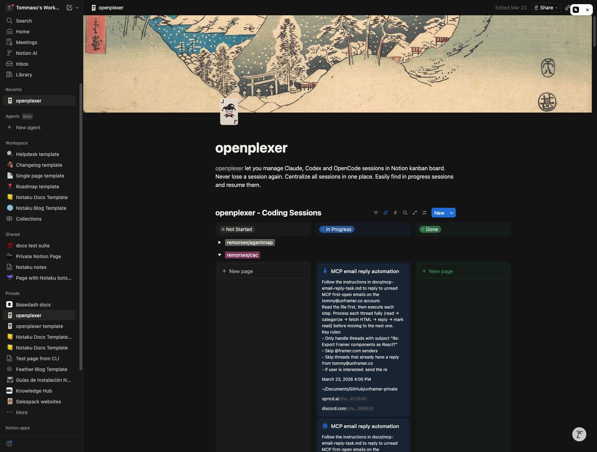

# openplexer

Track every coding session across your team in a Notion board. Automatically.

```
npm install -g openplexer
```



## The problem

AI coding agents are everywhere now. OpenCode, Claude Code, Codex — you run them in worktrees, in different repos, on different branches. You start a session to fix a bug, another to refactor auth, another to explore an idea. Some finish, some don't. Some need your attention, some are fine.

After a week you have 40+ sessions scattered across your machine with no way to tell which ones matter.

**For solo developers**, it's hard to keep track. You forget about sessions. You don't know which worktree has unfinished work. You resume the wrong one. You lose context.

**For teams**, it's worse. You have no idea what your teammates are working on right now. You can't see if someone already started a session on the bug you're about to fix. There's no shared view of who's doing what, on which branch, in which repo. No way to flag a session as "needs review" or "blocked" or "done — merge it."

## The solution

openplexer runs as a background daemon on your machine. It connects to your coding agents via ACP (Agent Client Protocol), discovers all your sessions, and syncs them to a Notion kanban board — automatically, every 5 seconds.

```
┌──────────────┐                     ┌────────────────────────┐
│  OpenCode    │◄── ACP (stdio) ────►│                        │
│  Claude Code │◄── ACP (stdio) ────►│      openplexer        │
│  Codex       │◄── ACP (stdio) ────►│      (background)      │
└──────────────┘                     │                        │
                                     │  syncs every 5 seconds │
                                     └───────────┬────────────┘
                                                 │
                                                 │ Notion API
                                                 ▼
                                     ┌────────────────────────┐
                                     │      Notion Board      │
                                     │     (shared kanban)    │
                                     └────────────────────────┘
```

Each session becomes a card on the board with its title, repo, branch, model, prompt, and links. You can see at a glance:

- **What's in progress** — sessions that are still running
- **What's done** — completed sessions you can archive or review
- **What needs attention** — sessions you manually flag for follow-up
- **Which repo and branch** — direct links to the GitHub branch and PR
- **How to resume** — a ready-to-paste CLI command to pick up where you left off

## Getting started

Install globally and run once — the setup wizard handles everything:

```bash
npm install -g openplexer
openplexer
```

The wizard walks you through 4 steps:

### 1. Pick your agents

```
◆  Which coding agents do you use?
│  ◼ OpenCode
│  ◼ Claude Code
│  ◻ Codex
```

Select the agents you have installed. openplexer spawns each one's ACP server, lists all existing sessions, and auto-discovers every git repo you've been working in.

### 2. Select repos to track

```
◆  Which repos to track?
│  ◼ * All repos
│  ◻ acme/backend
│  ◻ acme/frontend
│  ◻ acme/infra
```

The repos are auto-detected from your session working directories — no manual config. Pick specific repos for shared team boards (keeps personal projects off) or select all.

### 3. Connect Notion

Your browser opens to Notion's OAuth page. Authorize the integration and select which page to share. No API tokens, no secrets, no `.env` files — just click authorize.

Behind the scenes: the CLI generates a random state token, opens `openplexer.com/auth/notion?state=<token>` in your browser, which redirects to Notion OAuth. After you authorize, `openplexer.com` (a Cloudflare Worker) exchanges the code for access + refresh tokens, stores them in KV with a 5-minute TTL. The CLI polls `/auth/status?state=<token>` until the tokens arrive.

### 4. Board created — sessions sync immediately

openplexer creates a database inside your selected Notion page with a **kanban Board view** grouped by status (Not Started → In Progress → Done). Cards are sub-grouped by repo. An example card explains what each field means.

The daemon starts syncing immediately. New sessions appear as cards within seconds. The CLI then asks if you want to register openplexer to run on login — say yes and it stays running in the background permanently.

```
◆  Register openplexer to run on login?
│  Yes
```

That's it. Every coding session you start from now on automatically appears on the board.

## Collaborative boards

The board is a shared Notion page. Multiple team members install openplexer, run the setup wizard, and connect to the **same shared page**. Each person's sessions show up automatically.

- Alice is refactoring the auth module on `feature/auth-v2` in `acme/backend` — **In Progress**
- Bob finished the migration script on `fix/db-migrate` in `acme/infra` — **Done**
- Charlie's session on `acme/frontend` needs review — **Needs Attention**

No standups needed. No Slack messages asking "are you still working on that?" The board is always current.

Each user controls which repos they sync. Personal side projects stay off the shared board.

## Board properties

Every session card has these fields:

| Property | Type | Description |
|---|---|---|
| **Name** | Title | Session title generated by the agent |
| **Status** | Status | `Not Started`, `In Progress`, `Done` (you manage this manually) |
| **Activity** | Select | `Running` (agent generating) or `Idle` (waiting for input). OpenCode only |
| **Repo** | Select | GitHub repo as `owner/repo` |
| **Branch** | Rich text | Clickable link to the branch on GitHub |
| **Model** | Rich text | AI model used (e.g. `claude-sonnet-4-20250514`) |
| **Prompt** | Rich text | First user message that started the session |
| **PR** | URL | GitHub pull request URL (auto-detected via `gh` CLI) |
| **Share URL** | URL | Public share link (OpenCode `/share`) |
| **Resume** | Rich text | CLI command to resume the session |
| **Folder** | Rich text | Local filesystem path (e.g. `~/projects/repo`) |
| **Kimaki** | URL | Discord thread link (if using [kimaki](https://kimaki.xyz)) |
| **Created** | Date | When the session was first synced |
| **Updated** | Date | Last update timestamp from the agent |
| **Session ID** | Rich text | Internal ACP session identifier |

**Status** is the only field you manage manually — drag cards between columns to triage. Everything else syncs automatically.

**Resume** gives you the exact command to pick up a session:

```bash
# OpenCode
opencode --session ses_abc123

# Claude Code
claude --resume ses_abc123

# Codex
codex resume ses_abc123
```

### Assignee (opt-in)

The Assignee people property is disabled by default because Notion sends a notification on every new card. Enable it with:

```bash
openplexer --assignee
```

Then silence the notifications: open the board in Notion → click the **Assignee** property header → under **Notify**, select **None**.

## CLI commands

```bash
openplexer                  # Start daemon (first run triggers setup wizard)
openplexer connect          # Add another board
openplexer status           # Show sync state and session counts
openplexer boards           # List all configured boards with URLs
openplexer stop             # Kill the running daemon
openplexer startup          # Show startup registration status
openplexer startup enable   # Register to run on login
openplexer startup disable  # Unregister from login
```

## Multiple boards

Connect as many boards as you want — each is a separate Notion database with its own repo filter.

```bash
openplexer connect
```

Use cases:
- **Team board** — shared page, filtered to company repos, everyone connects
- **Personal board** — private page, all repos, just for you
- **Project board** — scoped to a single repo for focused tracking

## How it works

**ACP protocol** — openplexer spawns each agent's ACP server as a child process. For OpenCode it uses the HTTP API (`opencode serve`) to get sessions across all projects globally. For Claude Code and Codex it uses ACP over stdio.

**Sync loop** — every 5 seconds, openplexer polls all connected agents. New sessions get a Notion page created. Existing sessions get their title, timestamp, and activity updated. Only sessions created or updated after the board was connected are synced (no backfilling).

**Token refresh** — Notion OAuth tokens expire. openplexer automatically refreshes them through the `openplexer.com` worker, which holds the client secret server-side. The CLI never touches Notion API credentials directly.

**PR detection** — if `gh` CLI is installed, openplexer checks for open PRs matching each session's branch and adds a link. Retries for 10 minutes after session creation since PRs are often opened after the session starts.

**Title grace period** — agents generate session titles asynchronously. openplexer waits up to 5 minutes for titles to be generated before syncing, so cards don't appear with placeholder names.

**Single instance** — a lock port ensures only one daemon runs at a time. Starting a new instance cleanly terminates the old one.

**Startup service** — cross-platform registration:
- **macOS**: launchd plist at `~/Library/LaunchAgents/com.openplexer.plist`
- **Linux**: XDG autostart at `~/.config/autostart/openplexer.desktop`
- **Windows**: registry key at `HKCU\...\Run`

**Config** — stored at `~/.openplexer/config.json`. Contains agents, board configs (Notion tokens, database IDs, tracked repos), and a map of synced session IDs to Notion page IDs.

## Discord integration

If you use [kimaki](https://kimaki.xyz) to run coding sessions from Discord, openplexer automatically detects the kimaki CLI and adds a Discord thread URL to each session card. This links the Notion board directly to the Discord conversation where the work is happening.

## License

MIT
